# Podery Mildew Detection in Cherry Leaves Project

...

 

## 
TABLE OF CONTENT

- [Project Overview](#project-overview)
- [CRISP-DM](#crisp-dm)
- [Dataset Content](#dataset-content)
- [Business Requirements](#business-requirements)
- [Hypothesis](#hypothesis)
- [The rationale to map the business requirements to the Data Visualisations and ML tasks](#ml-tasks)
- [ML Business Case](#ml-business-case)
- [Dashboard Design](#dashboard-design)
- [Manual Testing](#manual-testing)
- [Unfixed Bugs](#unfixed-bugs)
- [Deployment](#deployment)
- [Project Structure](#projects-structure)
- [Platforms](#platforms)
- [Languages](#languages)
- [Main Data Analysis and Machine Learning Libraries](#main-libraries)
- [Credits](#credits)

 

## 
PROJECT OVERVIEW

--- 

This project aims to develop a solution for differentiating healthy cherry leaves from those affected by powdery mildew using image analysis. Additionally, it involves building a predictive model to automatically classify cherry leaves as healthy or containing powdery mildew.

 

## 
CRISP-DM

--- 

**Cross-Industry Standard Process for Data Mining**
is a widely used methodology for data mining and machine learning projects. It provides a structured approach to guide teams through the entire data mining process, from understanding business objectives to deploying predictive models.

CRISP-DM is utilized in various industries and domains where data mining and machine learning techniques are applied. It helps organizations and data science teams to:
1. Understand business objectives and requirements.
2. Explore and understand the data available for analysis.
3. Prepare and preprocess data for modeling.
4. Build, evaluate, and fine-tune predictive models.
5. Deploy models into operational systems.
6. Monitor model performance and maintain them over time.

By following the CRISP-DM methodology, organizations can effectively manage and execute data mining projects, leading to better insights and actionable results from their data.

<b>CRISP-DM</b>

 

## 
DATASET CONTENT

--- 

**Dataset**: [Cherry Leaf Dataset on Kaggle](https://www.kaggle.com/datasets/codeinstitute/cherry-leaves).

The dataset for the Mildew Detection in Cherry Leaves project consists of a collection of cherry leaf images, each labeled to indicate whether the leaf is healthy or affected by powdery mildew. Here are the key details regarding the dataset:

- **Number of Samples**: The dataset comprises 4208 curated photographs featuring individual cherry leaves set against a neutral backdrop. 

- **Data Format**: The images are typically in common image formats such as JPEG or PNG.

- **Labeling**: Each image in the dataset is labeled with one of two classes:
  - **Healthy**: Cherry leaves that are free from powdery mildew.
  - **Powdery Mildew**: Cherry leaves that show signs of powdery mildew infection.

- **Data Variability**: The dataset includes images of cherry leaves with varying degrees of powdery mildew infection. This variability is essential for training a robust model.

- **Data Collection**: The images were gathered and categorized by Farmy & Foods Company, operating under a confidential non-disclosure agreement (NDA).

- **Data Distribution**: The dataset is divided into training, validation, and test sets for machine learning purposes.

- **Additional Information**: The dataset originally consists of images sized at 256 pixels × 256 pixels. However, for practicality and to meet project requirements, these images have been reshaped to dimensions like 50 × 50. This resizing is essential for managing the model's file size and ensuring that it aligns with the project's specifications effectively.

### Image Samples

 **Healthy Leaves** 

  

**Powdery Mildew Infected Leaves**

  

 

## 
BUSINESS REQUIREMENTS

--- 

The cherry plantation crop from Farmy & Foods faces a challenge where their cherry plantations have been presenting powdery mildew. Currently, the process is to verify if a given cherry tree contains powdery mildew manually. An employee spends around 30 minutes in each tree, taking a few samples of tree leaves and demonstrating visually if the leaf tree is healthy or has powdery mildew. If it has powdery mildew, the employee applies a specific compound to kill the fungus. The time spent using this compound is 1 minute. The company has thousands of cherry trees on multiple farms nationwide. As a result, this manual process could be more scalable due to the time spent in the manual process inspection.

To save time, the IT team suggested an ML system that can detect instantly, using a leaf tree image, if it is healthy or has powdery mildew. A similar manual process is in place for other crops for detecting pests. If this initiative is successful, there is a realistic chance to replicate this project in all other crops. The dataset is a collection of cherry leaf images provided by Farmy & Foods, taken from their crops.

The project addresses the following business requirements:
1. **Visual Differentiation**: The client requires a study to visually differentiate healthy cherry leaves from those containing powdery mildew.
2. **Powdery Mildew Detection**: The client seeks to predict whether a cherry leaf is healthy or infected with powdery mildew.

 

## 
HYPOTHESIS

--- 

### Hypothesis 1: Image Analysis for Powdery Mildew Identification
- **Hypothesis:**
  - The presence of powdery mildew on leaves can be accurately identified through image analysis.
- **Validation Methods:**
  - Image Montage Analysis: Powdery mildew-affected leaves exhibit patches of white coating and discoloration.
  - Average Image Comparison: Powdery mildew-affected leaves tend to be lighter in color compared to healthy leaves.
  - Variability and Average Difference Images: There is no significant variation around the middle of either leaf, but clear contrast variation is observed around the middle of healthy leaves.
  - Grayscale Visualization: Grayscale images were generated from the original leaf images to analyze texture and intensity variations.
  - HSV (Hue, Saturation, Value) Color Space Conversion: Leaf images were converted to the HSV color space to analyze color variations and patterns.
- **Conclusions:**
  - The image analysis approach has shown promising results in accurately identifying powdery mildew-affected leaves from healthy leaves.
  - Image montage analysis and average image comparison provided valuable insights into the visual differences between healthy and affected leaves.
  - Variability and average difference images highlighted contrast variations, aiding in the identification process.
  - Grayscale visualization and HSV color space conversion provided additional dimensions for analyzing texture, intensity, color variations, and patterns, enhancing the accuracy of powdery mildew identification.

  **To visually explore features of both infected and healthy leaves, please visit the [Cherry Leaf Visualizer page]().**

 
### Hypothesis 2: Machine Learning for Cherry Leaf Health Prediction
- **Hypothesis:**
  - Machine learning can predict if a cherry leaf is healthy or contains powdery mildew based on leaf images.
  - A user-friendly dashboard can be developed to provide instant cherry leaf health assessments based on uploaded images.
- **Validation Methods:**
  - Machine Learning Model: A machine learning model was trained using a dataset of labeled leaf images to automate the identification process. This model was validated against real-world samples.
  - Development of Dashboard: A user-friendly dashboard was developed to provide instant cherry leaf health assessments based on uploaded images.
- **Conclusions:**
  - The machine learning model demonstrated strong potential for automation, and ongoing validation will provide further insights into its effectiveness.
  - Further experimentation and validation are ongoing to refine the method and ensure its reliability in real-world scenarios.
  - The findings suggest that automated image analysis can be a valuable tool in agricultural disease detection and management.
  - Ongoing development and refinement of the dashboard will enhance its usability and effectiveness in providing instant health assessments.

  **For an in-depth analysis of the model's performance metrics, please proceed to the [ML Performance Metrics page]() and [Powdery Mildew Detection page]().**

 

## 
THE RATIONALE TO MAP THE BUSINESS REQUIREMENTS TO THE DATA VISUALIZATIONS AND ML TASKS

--- 

**Business Requirement 1:**

The client's foremost objective is to effectively distinguish between healthy cherry leaves and those infected by powdery mildew, framing the task as a classification problem. To achieve this, we need a dataset that encompasses two distinct classes: healthy leaves and those exhibiting powdery mildew. We'll then assess the balance of the data, ensuring an equitable distribution of labels across both classes. If the data is balanced, indicating similar frequencies for each class, we'll proceed with further analysis. Our initial steps will involve creating an Image Montage to visually inspect differences between the two classes using the provided dataset. Additionally, we'll examine the average and variability images for both classes to discern patterns present on the leaves.

**Business Requirement 2:**

If the dataset demonstrates balance, extensive cleaning will be unnecessary, enabling us to address the second requirement: predicting whether a new leaf is healthy or affected by powdery mildew. Subsequently, we will deliver a dashboard solution to the client. Utilizing Convolutional Neural Networks for image prediction, the model will discern patterns, colors, and variations to categorize the leaves effectively. The dashboard will encompass both an image montage feature and a prediction capability, streamlining the process of identifying affected plants and enhancing operational efficiency. The client will have the flexibility to employ the dashboard for any quantity of cherry leaves, facilitating the provision of healthy fruit to their customers.

 

## 
ML BUSINESS CASE

---

### 1. **Business Requirements:**
- The client seeks a solution to distinguish healthy cherry leaves from those infected with powdery mildew. ML offers the capability to analyze images and classify them accurately based on learned patterns.

### 2. **Conventional Data Analysis:**
- Traditional data analysis methods can address the first requirement. However, ML is essential for fulfilling the second requirement, which involves image classification.

### 3. **Dashboard Requirement:**
- The client's need is for a dashboard interface to visualize the results and predictions, indicating the necessity of a user-friendly interface.

### 4. **Successful Project Outcome:**
- The successful outcome involves accurately differentiating between healthy and powdery mildew-infected cherry leaves, accompanied by a user-friendly dashboard for visualizing results and making predictions.

### 5. **Epics and User Stories:**
- The project can be segmented into distinct epics and user stories to manage tasks effectively.

<b>User Stories</b>

| **User Story**                                                                                                                                                                       | **Business Requirement** |
|-------------------------------------------------------------------------------------------------------------------------------------------------------------------------------------------|--------------------------|
| As a client, I can navigate easily around an interactive dashboard so that I can view and understand the data presented.                                                                  | Visual Differentiation   |
| As a client, I can view an image montage of either healthy or powdery mildew-affected cherry leaves so that I can visually differentiate them.                                        | Visual Differentiation   |
| As a client, I can view and toggle visual graphs of average images (and average image difference) and image variabilities for both healthy and powdery mildew-affected cherry leaves so that I can observe the difference and understand the visual markers that indicate leaf quality better. | Visual Differentiation   |
| As a client, I can access and use a machine learning model so that I can obtain a class prediction on a cherry leaf image provided.                                                      | Powdery Mildew Disease Detection |
| As a client, I can provide new raw data on a cherry leaf and clean it so that I can run the provided model on it.                                                                          | Powdery Mildew Disease Detection |
| As a client, I can feed cleaned data to the dashboard to allow the model to predict it so that I can instantly discover whether a given cherry leaf is healthy or affected by powdery mildew.                                                    | Powdery Mildew Disease Detection |
| As a client, I can save model predictions in a timestamped CSV file so that I can keep an account of the predictions that have been made.                                                   | Powdery Mildew Disease Detection |
| As a client, I can view an explanation of the project's hypotheses so that I can understand the assumptions behind the machine learning model and its predictions.                     | Dashboard Development    |
| As a client, I can view a performance evaluation of the machine learning model so that I can assess its accuracy and effectiveness.                                                        | Dashboard Development    |
| As a client, I can access pages containing the findings from the project's conventional data analysis so that I can gain additional insights into the data and its patterns.         | Dashboard Development    |

**Find the Kanban board Project [here](https://github.com/users/adamolnar/projects/10/views/1?layout=board).**

 

### 6. **Ethical and Privacy Considerations:**
- Due to the non-disclosure agreement, data privacy is paramount, and access should be restricted to authorized personnel only.

### 7. **Model Selection:**
- The nature of the data suggests the need for a binary classification model, which is suitable for distinguishing between two classes.

### 8. **Model Inputs and Outputs:**
- Input: Cherry leaf images; Output: Predictions indicating whether the leaf is healthy or infected with powdery mildew.

### 9. **Performance Goals:**
- The project aims for a minimum accuracy of 97%, although the model has been trained to achieve even higher accuracy.

### 10. **Client Benefits:**
- By implementing the ML solution, the client can ensure the quality of their product and streamline their operations by automating the detection of powdery mildew, thus reducing manual efforts.

 

## 
DASHBOARD DESIGN

--- 

The Project Overview section provides a comprehensive understanding of the project's objectives and purpose. It includes details about the dataset utilized, breaks down the problem statement, and outlines the step-by-step plan devised to effectively address and resolve the challenge at hand.

### 1. **Home Page**: 
The 'Home Page' serves as an introduction to the Cherry Leaf Mildew Detection App, providing users with information on how to use the app and what they can expect to find in each section.

HOME PAGE

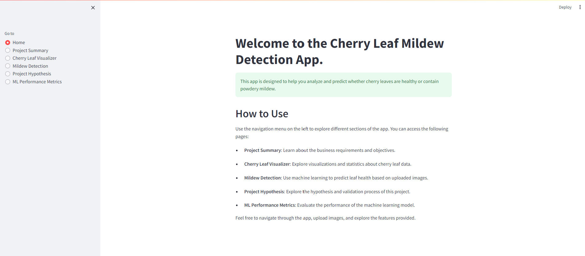

### 2. **Project Summary**: 
The "Project Summary" page provides a comprehensive overview of the Cherry Leaf Mildew Detection project. It offers general information about the project's purpose, dataset, and primary business requirements. Users can learn about the significance of detecting powdery mildew on cherry leaves, the impact it can have on crop yield, and the importance of early detection for effective disease management. Additionally, details about the project dataset, including the types of images available and their role in training the machine learning model, are provided. The page also outlines the three main business requirements driving the project, which include visual differentiation of healthy and infected leaves, powdery mildew detection, and the development of a dashboard to meet these objectives. Overall, the "Project Summary" page serves as a foundational resource for understanding the scope and goals of the Cherry Leaf Mildew Detection project.

PROJECT SUMMARY PAGE

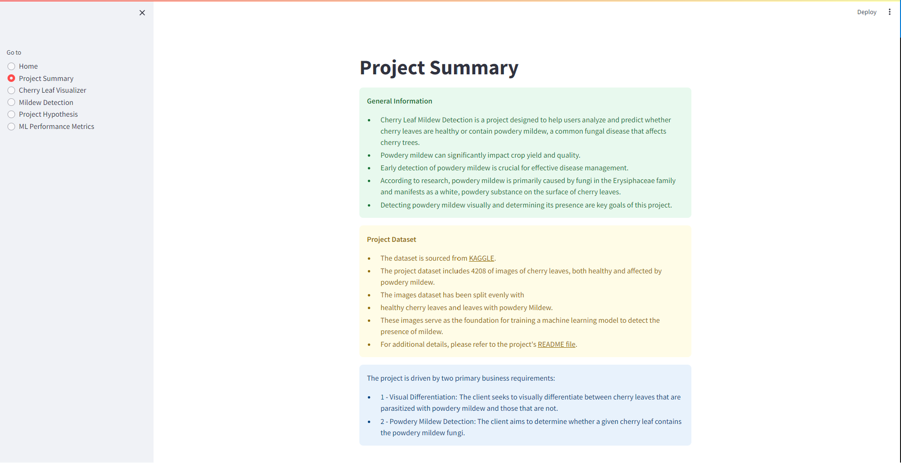

### 3. **Cherry Leaf Visualizer**: 
The "Data Visualization" page provides users with interactive tools to visually explore various aspects of the cherry leaf dataset. Its primary purpose is to facilitate a deeper understanding of the characteristics that differentiate healthy cherry leaves from those infected with powdery mildew.

Key functionalities of the page include:

- **Leaves Visualizer Section:** This section introduces the purpose of visual differentiation between healthy and powdery mildew-infected leaves, setting the context for the subsequent visualizations.

- **Visualization Options:** Users can select from multiple visualization options:
   - **Difference between Average and Variability Images:** Compares the average and variability images of powdery mildew and healthy leaves.

      

      
AVARGE AND VARIABILITY IMAGES

      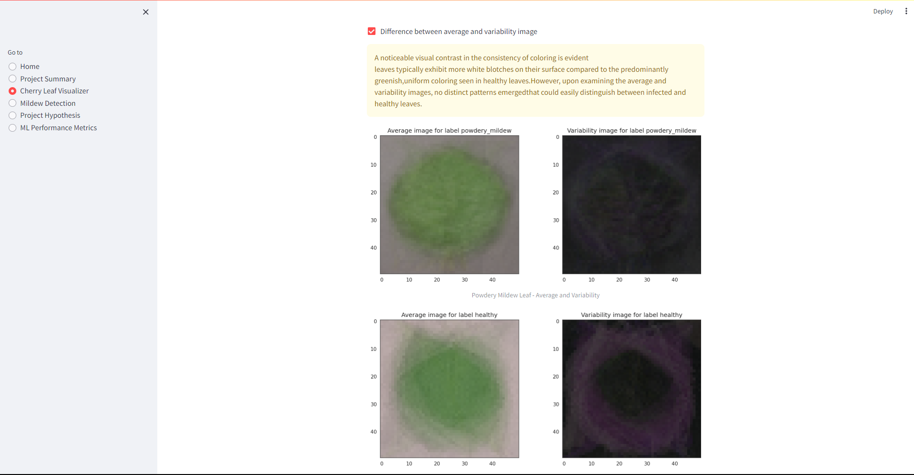
      

   - **Differences between Average Powdery Mildew and Healthy Leaves:** Illustrates differences between the average images of powdery mildew and healthy leaves.

      

      
AVARGE POWDERY MILDEW AND HEALTHY LEAVES IMAGES

      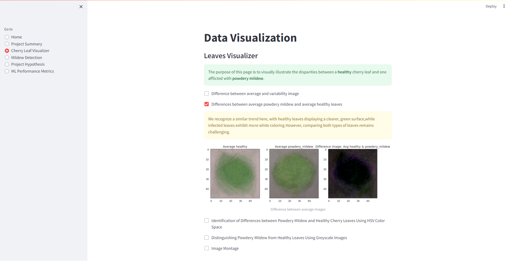
      

   - **Identification of Differences using HSV Color Space:** Shows how the HSV color space can help distinguish between powdery mildew and healthy leaves.

      

      
DIFFERENCES USING HSV COLOR SPACE IMAGES

      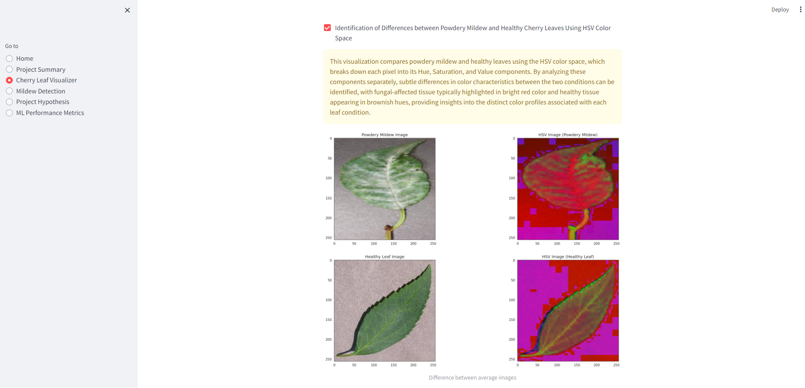
      

   - **Distinguishing Powdery Mildew from Healthy Leaves using Grayscale Images:** Demonstrates the use of grayscale images to differentiate between powdery mildew and healthy leaves.

      

      
GREYSCALE IMAGES

      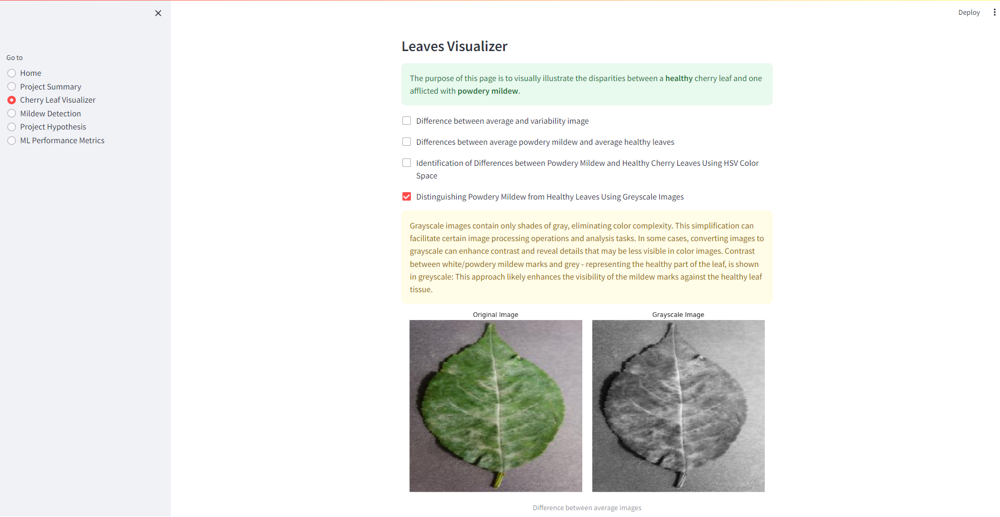
      

   - **Image Montage:** Allows users to create a montage of randomly selected images from specified categories, providing a visual overview of the dataset.

      

      
IMAGE MONTAGE

      
      

- **Dynamic Updates:** The page dynamically updates based on user interactions, allowing users to explore different visualization options and adjust parameters as needed.

Overall, the "Data Visualization" page serves as a valuable tool for users to gain insights into the characteristics of cherry leaves affected by powdery mildew and aids in the development of strategies for disease detection and management.

CHERRY LEAF VISUALIZER PAGE

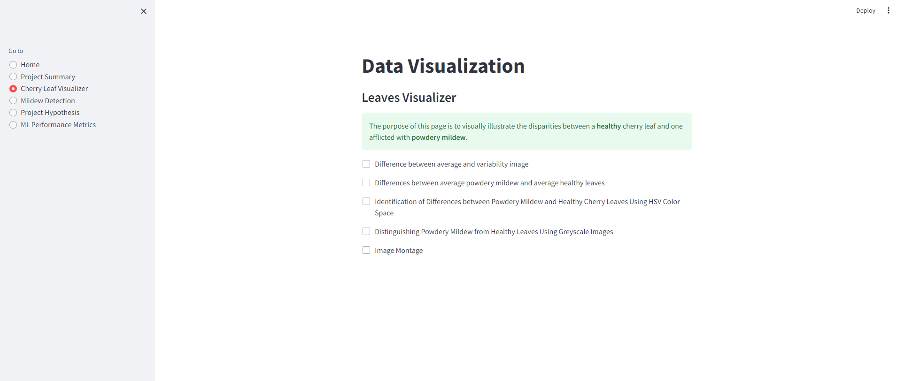

### 4. **Mildew Detection**: 
The "Mildew Detector" application serves the purpose of predicting whether a cherry leaf is healthy or contains powdery mildew, a common fungal disease affecting cherry trees. Users can upload cherry leaf images, and the application provides predictions along with confidence scores. The predictions are based on a machine learning model trained on a dataset of healthy and powdery mildew-affected cherry leaves.

Key features of the application include:

- **Upload Images**: Users can upload one or multiple cherry leaf images for prediction.

- **Live Prediction**: For each uploaded image, the application provides a prediction indicating whether the leaf is healthy or affected by powdery mildew. Additionally, it displays a confidence score indicating the certainty of the prediction.

- **Analysis Report**: The application generates an analysis report containing the names of uploaded images, their corresponding predictions, and confidence scores. Users can download this report as a CSV file for further analysis.

- **Data Source**: Users are provided with a link to download a dataset containing images of healthy and powdery mildew-affected cherry leaves for testing and exploration purposes.

Overall, the "Mildew Detector" application offers a convenient way to assess the health of cherry leaves and detect the presence of powdery mildew, contributing to early disease detection and effective management in cherry tree cultivation.

MILDEW DETECTION PAGE

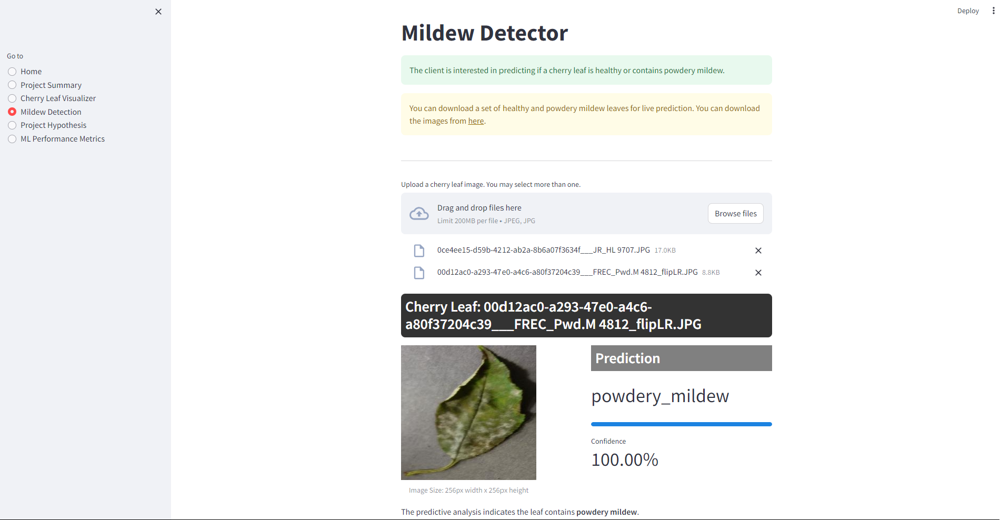

### 5. **Project Hypothesis**: 
The "Project Hypothesis and Validation" page provides a detailed overview of the hypotheses formulated and the validation methods employed in the cherry leaf mildew detection project. It consists of three main sections:

- **Hypothesis 1**: Image Analysis for Powdery Mildew Identification: This section presents the hypothesis that the presence of powdery mildew on leaves can be accurately identified through image analysis. It outlines various validation methods, including image montage analysis, average image comparison, variability, average difference images, grayscale visualization, and HSV color space conversion.

- **Hypothesis 2**: Machine Learning for Cherry Leaf Health Prediction: Here, the hypothesis is that machine learning can predict if a cherry leaf is healthy or contains powdery mildew based on leaf images. The validation methods involve training a machine learning model using a dataset of labeled leaf images and validating it against real-world samples.
Dashboard Development for Instant Health Assessment: This section discusses the hypothesis that a user-friendly dashboard can be developed to provide instant cherry leaf health assessments based on uploaded images. The validation method includes the development of a dashboard for instant health assessments.

Each hypothesis is accompanied by its respective validation methods, providing insights into how the hypotheses were tested and evaluated. Finally, the conclusions drawn from the observations and methods are summarized, highlighting the project's findings and implications.

PROJECT HYPHOTEHESIS 1 PAGE 

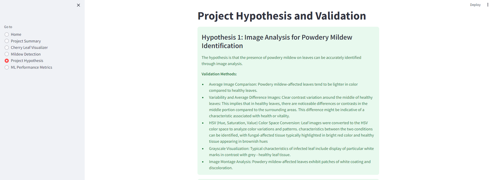

PROJECT HYPHOTEHESIS 2 PAGE 

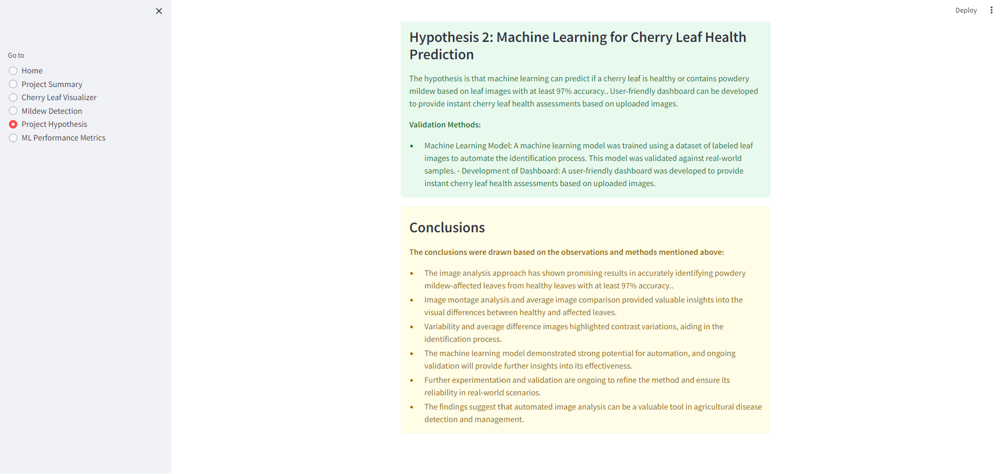

### 6. **ML Performance Metrics**:

* The "ML Performance" page reveals the robustness and efficacy of the machine learning model in classifying images of healthy leaves and those affected by powdery mildew. The dataset, consisting of 4208 images evenly split between the two classes, underwent meticulous partitioning into Train, Validation, and Test sets to ensure balanced representation.

  

  
LEBELS FREQUENCIES BAR CHART

  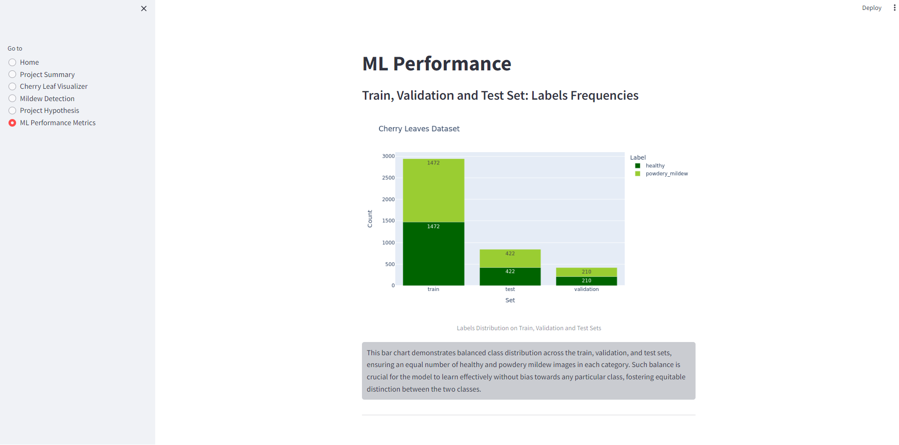
  

  

  
PIE CHART

  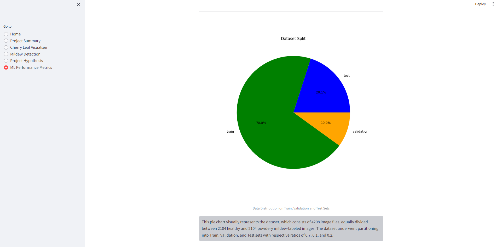
  

* The **model's training phase** exhibited promising progress, as depicted by the plotted accuracy and loss metrics. The gradual increase in accuracy over epochs, coupled with a steady decline in loss, indicates the model's ability to effectively learn from the training data without suffering from overfitting or underfitting. This balanced learning curve suggests the model's capacity to generalize well to unseen data while minimizing errors.

  

  
MODEL HISTORYT

  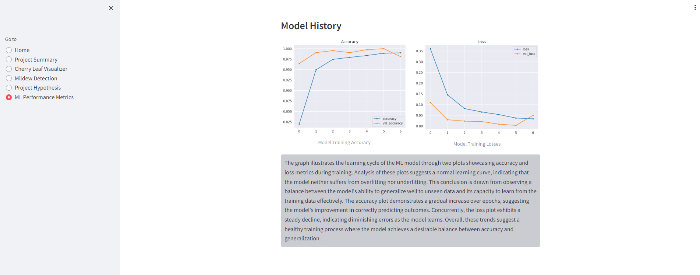
  

* Upon evaluation on the **Test set**, the model showcased remarkable performance, with a reported loss value of 0.0457 and an accuracy score of 99.17%. These metrics underscore the model's strong predictive capabilities and robust generalization to new instances.

  

  
GENERALISED PERFORMANCE ON TEST SET

  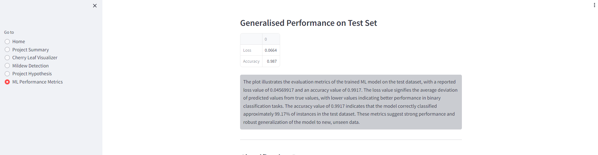
  

* Further insights are gleaned from the **classification report**, which highlights exceptional precision, recall, and F1-score metrics for both "healthy" and "powdery mildew" classes. The model's ability to minimize false positives and false negatives underscores its accuracy and reliability in classification tasks.

  

  
CLASSIFICATION REPORT

  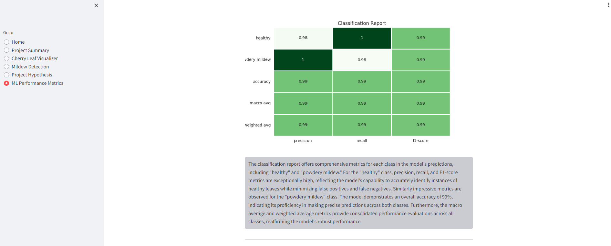
  

* The **confusion matrix** provides a granular breakdown of the model's predictions, reaffirming its high accuracy (99%) and proficiency in making correct classifications.

  

  
CONFUSION MATRIX

  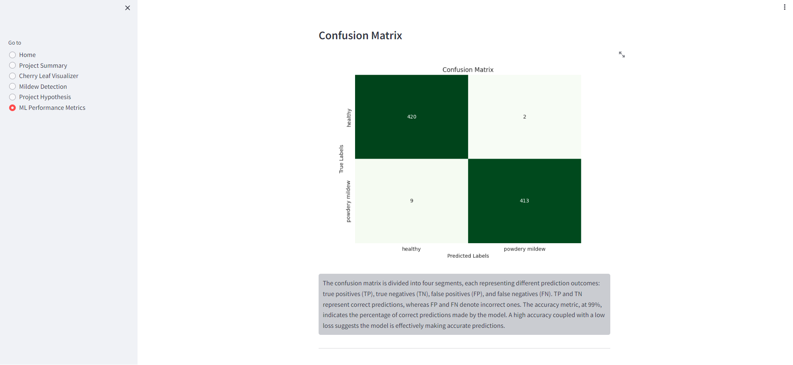
  

* Lastly, the **ROC curve** analysis sheds light on the model's discrimination capabilities, indicating its effectiveness in distinguishing between classes across different classification thresholds. Overall, the ML performance overview attests to the model's robustness, precision, and reliability in accurately classifying healthy and powdery mildew-affected leaves.

  

  
ROC CURVE

  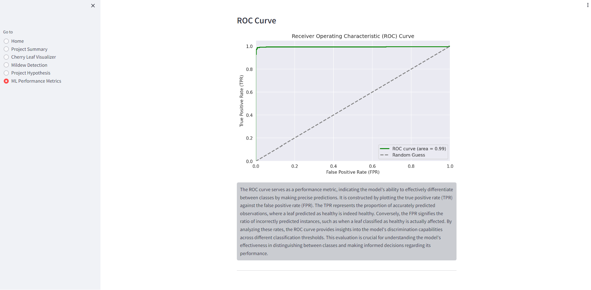
  

 

## 
MANUAL TESTING

--- 

MANUAL TESTING

| Test Case | Description                                     | Expected Result                       | Pass/Fail |
|-----------|-------------------------------------------------|---------------------------------------|-----------|
| Home Page Navigation       | Verify that users can navigate through different sections of the app from the home page.              | Users can navigate without errors       | ✅        |
| Download Healthy and Powdery Mildew Leaf Images | Click on the provided link to download a set of healthy and powdery mildew leaf images. | Images are downloaded successfully. | ✅ |
| Upload Healthy Leaf Image | Upload an image of a healthy cherry leaf for analysis. | Image is processed successfully       | ✅        |
| Upload Mildew-Infected Leaf Image | Upload an image of a cherry leaf infected with powdery mildew. | Image is processed successfully       | ✅        |
| Download CSV | Click on the provided link to download a CSV file. | CSV file is downloaded successfully. | ✅ |
| Difference between average and variability image | Tick the checkbox "Difference between average and variability image" on the Cherry Leaf Visualizer page. | A plot of the mean and variability of images appears along with the observation block. | ✅ |
| Differences between average powdery mildew and average healthy leaves | Tick the checkbox "Differences between average powdery mildew and average healthy leaves" on the Cherry Leaf Visualizer page. | A plot of average healthy, average powdery mildew cherry leaves and the difference appears along with the observation block. | ✅ |
| Identification of Differences between Powdery Mildew and Healthy Cherry Leaves Using HSV Color Space | Tick the checkbox "Identification of Differences between Powdery Mildew and Healthy Cherry Leaves Using HSV Color Space" on the Cherry Leaf Visualizer page. | A comprehensive comparison between powdery mildew and healthy leaves using HSV representations appears. | ✅ |
| Distinguishing Powdery Mildew from Healthy Leaves Using Greyscale Images | Tick the checkbox "Distinguishing Powdery Mildew from Healthy Leaves Using Greyscale Images" on the Cherry Leaf Visualizer page. | Grayscale comparison images appear, facilitating differentiation between powdery mildew and healthy leaves. | ✅ |
| Create Montage | Tick the "Image Montage" checkbox. Choose a label from the dropdown menu and click on the button "Create Montage". | The Image Montage section appears, the dropdown menu functions correctly and the montage with the selected label is created. | ✅ |
| Cherry Leaf Visualizer Page | Navigate to the Cherry Leaf Visualizer page. | Page loads without errors             | ✅        |
| Upload Dataset for ML | Upload a dataset for machine learning analysis. | Dataset is uploaded successfully      | ✅        |
| ML Performance Metrics Page | Access the ML Performance Metrics page. | Page displays relevant performance metrics    | ✅        |

 

## 
UNFIXED BUGS

--- 

- ...

 

## 
DEPLOYMENT

--- 

#### Setup Workspace

1. **Heroku Deployment:**
   - Go to your Heroku account page.
   - Choose "CREATE NEW APP," give it a unique name, and select a geographical region.
   - Add the `heroku/python` buildpack from the Settings tab.
   - From the Deploy tab, choose GitHub as the deployment method, connect to GitHub, and select the project's repository.
   - Select the branch to deploy, then click "Deploy Branch."
   - Click to "Enable Automatic Deploys" or choose "Deploy Branch" from the Manual Deploy section.
   - Wait for the logs to run while the dependencies are installed and the app is being built.
   - The mock terminal is then ready and accessible from a link similar to `https://your-projects-name.herokuapp.com/`.
   - If the slug size is too large, add large files not required for the app to the `.slugignore` file.

2. **Forking the GitHub Project:**
   - To create a copy of the GitHub repository:
     - Navigate to the repository page and click the "Fork" button. This creates a copy on your GitHub account.

3. **Making a Local Clone:**
   - On the repository page, click on the "Code" button.
   - Copy the HTTPS URL to clone the repository.
   - Open your IDE and change the working directory to the desired location.
   - Type `git clone` in the terminal and paste the URL to clone the repository.

 

## 
PROJECT STRUCTURE

--- 

- `.devcontainers/`: Configuration files for development containers.
- `app_pages/`: Contains different pages of the web application.
- `input/`: Input data and resources.
- `jupyter_notebooks/`: Jupyter notebooks for data exploration and model development.
- `outputs/`: Generates files as part of its operation, such as reports, logs, or data exports
- `src/`: Python source code for the project.
- `static/`: Contains static assets like images and stylesheets.
- `app.py`: Main application script.
- `README.md`: Project documentation.
- `requirements.txt`: Lists project dependencies.

 

## 
PLATFORMS

--- 

- **Heroku**: Deployment platform for the project.
- **Jupyter Notebook**: Used for code editing.
- **Kaggle**: Source for downloading datasets.
- **GitHub**: Repository for storing project code.
- **Gitpod**: Writing and managing code, committing to GitHub, and pushing to GitHub Pages.

 

## 
LANGUAGES

--- 

- **Python**
- **Markdown** 

 

## 
MAIN DATA ANALYSIS AND MASCHINE LEARNING LIBRARIES

--- 

1. **TensorFlow** is an open-source library for machine learning and deep learning tasks. It provides tools for building and training neural networks.

2. **NumPy** is a library for numerical computing in Python. It provides support for large, multi-dimensional arrays and matrices, along with a collection of mathematical functions to operate on these arrays efficiently.

3. **Scikit-learn** is a machine learning library that provides simple and efficient tools for data mining and data analysis. It includes various algorithms for classification, regression, clustering, dimensionality reduction, and model selection.

4. **Streamlit** is a library for creating interactive web applications with Python. It allows developers to build data-driven apps quickly and easily by writing simple Python scripts.

5. **Pandas** is a library for data manipulation and analysis in Python. It provides data structures like DataFrame and Series, along with functions to clean, filter, and transform data.

6. **Matplotlib** is a plotting library for Python. It allows developers to create static, animated, and interactive visualizations in Python.

7. **Keras** is a high-level neural networks API, written in Python and capable of running on top of TensorFlow, Theano, or CNTK. It simplifies the process of building deep learning models by providing a simple and consistent interface.

8. **Plotly** is a graphing library for Python that makes interactive, publication-quality graphs online. It allows users to create interactive plots, dashboards, and web applications.

9. **Seaborn** is a Python visualization library based on matplotlib. It provides a high-level interface for drawing attractive and informative statistical graphics.

10. **OpenCV** (Open Source Computer Vision Library) is a library of programming functions mainly aimed at real-time computer vision. It provides tools and utilities for image processing, object detection, face recognition, and more, making it indispensable for computer vision applications.

 

## 
CREDITS

--- 

### Project Inspiration
- The idea for this project was inspired by [Mildew Detection in Cherry Leaves](https://learn.codeinstitute.net/courses/course-v1:CodeInstitute+PA_PAGPPF+2021_Q4/courseware/bde016cdbd184cdeafd341a73807e138/bd2104eb84de4e48a9df6f685773cbf2/).

### Project Template
- The project base template is sourced from the [milestone-project-mildew-detection-in-cherry-leaves](https://github.com/Code-Institute-Solutions/milestone-project-mildew-detection-in-cherry-leaves) Git repository.

### Dataset Source
- The dataset used in this project was obtained from [Kaggle](https://www.kaggle.com/datasets/codeinstitute/cherry-leaves).

### Project Content Reference
- The project content and structure were influenced by the Code Institute Walkthrough Project [Malaria Detector](https://learn.codeinstitute.net/courses/course-v1:code_institute+CI_DA_ML+2021_Q4/courseware/07a3964f7a72407ea3e073542a2955bd/29ae4b4c67ed45a8a97bb9f4dcfa714b/).

### Favicon Image
- The project favicon image was sourced from [Freepik](https://www.freepik.com/icon/leaf_892917).

### Acknowledgements
- Thank the people that provided support throughout this project.
